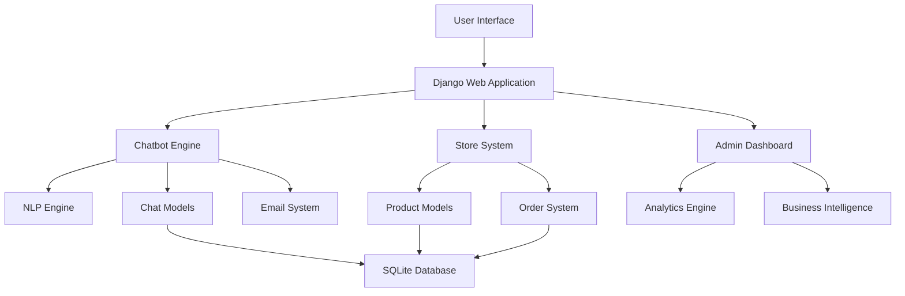
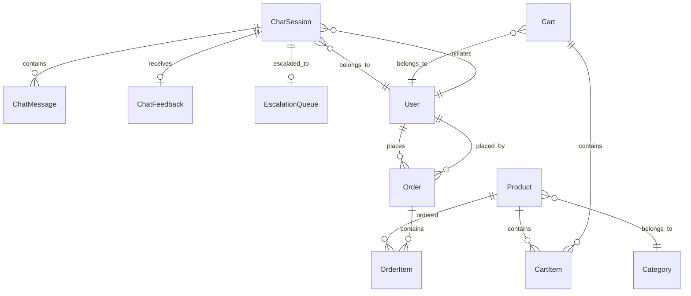

# Riverway Company Chatbot System - Comprehensive Documentation

## Table of Contents
1. [Project Overview](#project-overview)
2. [System Architecture](#system-architecture)
3. [Features and Functionality](#features-and-functionality)
4. [Technical Implementation](#technical-implementation)
5. [Functional Requirements](#functional-requirements)
6. [Non-Functional Requirements](#non-functional-requirements)
7. [Database Design](#database-design)
8. [API Documentation](#api-documentation)
9. [User Interface Design](#user-interface-design)
10. [Deployment and Configuration](#deployment-and-configuration)
11. [Testing and Quality Assurance](#testing-and-quality-assurance)
12. [Maintenance and Support](#maintenance-and-support)

---

## 1. Project Overview

### 1.1 Project Description
The Riverway Company Chatbot System is an intelligent, AI-powered customer service solution designed specifically for Riverway Company Limited, a hardware and building supplies retailer based in Ghana. The system provides automated customer support, product information, and seamless escalation to human agents when needed.

### 1.2 Business Context
**Company:** Riverway Company Limited  
**Industry:** Hardware, Automotive, and Construction Supplies  
**Location:** Accra, Ghana  
**Established:** 2006  
**Mission:** To provide quality products at affordable prices with excellent customer service

### 1.3 Project Goals
- **Primary Goal:** Enhance customer service through intelligent automation
- **Secondary Goals:**
  - Reduce response time for customer inquiries
  - Provide 24/7 customer support availability
  - Improve customer satisfaction and engagement
  - Reduce workload on human customer service staff
  - Gather valuable customer insights and analytics

### 1.4 Key Stakeholders
- **Primary Users:** Website visitors, customers seeking product information
- **Secondary Users:** Customer service staff, store managers
- **Administrators:** IT staff, business analysts, management team

---

## 2. System Architecture

### 2.1 Technology Stack

#### Backend Framework
- **Django 5.2.5**: Python web framework
- **Python 3.x**: Programming language
- **SQLite**: Development database
- **Django REST Framework**: API development

#### Frontend Technologies
- **HTML5**: Markup language
- **CSS3**: Styling with responsive design
- **Vanilla JavaScript**: Client-side interactions
- **Bootstrap Icons**: Icon library

#### Infrastructure
- **Django Development Server**: Local development
- **Email Integration**: Gmail SMTP for escalations
- **Session Management**: Django sessions
- **File Storage**: Local media storage

### 2.2 Application Structure
```
riverway/
├── manage.py                 # Django management script
├── riverway/                 # Main project configuration
│   ├── settings.py          # Project settings
│   ├── urls.py              # Main URL configuration
│   └── wsgi.py              # WSGI configuration
├── store/                   # E-commerce functionality
│   ├── models.py            # Product, Cart, Order models
│   ├── views.py             # Store views and logic
│   └── templates/           # Store templates
├── chatbot/                 # AI Chatbot system
│   ├── models.py            # Chat models and database schema
│   ├── views.py             # Chat API and endpoints
│   ├── nlp_engine.py        # Natural Language Processing
│   ├── email_backend.py     # Custom email backend
│   └── templates/           # Chat widget templates
├── admin_dashboard/         # Administrative interface
│   ├── views.py             # Dashboard views and analytics
│   └── templates/           # Admin templates
├── templates/               # Global templates
├── static/                  # Static assets
└── media/                   # Uploaded media files
```

### 2.3 System Architecture Diagram



---

## 3. Features and Functionality

### 3.1 Core Chatbot Features

#### 3.1.1 Natural Language Processing
- **Intent Recognition**: Identifies user intentions from text input
- **Entity Extraction**: Extracts relevant information (products, prices, dates)
- **Sentiment Analysis**: Determines customer sentiment (positive, negative, neutral)
- **Context Awareness**: Maintains conversation context across interactions

#### 3.1.2 Product Intelligence
- **Smart Product Search**: Advanced product matching algorithms
- **Inventory Integration**: Real-time stock availability checking
- **Product Recommendations**: Suggests related and alternative products
- **Pricing Information**: Provides current pricing and availability

#### 3.1.3 Multi-Channel Support
- **Website Widget**: Embedded chat widget on all pages
- **WhatsApp Integration**: Ready for WhatsApp Business API
- **Facebook Messenger**: Prepared for Messenger integration
- **Email Support**: Contact form processing and responses

#### 3.1.4 Intelligent Escalation
- **Automatic Detection**: Identifies when human intervention is needed
- **Escalation Triggers**: Multiple failed attempts, complaints, complex queries
- **Email Notifications**: Detailed escalation emails with conversation history
- **Queue Management**: Escalation queue for customer service staff

### 3.2 E-commerce Integration

#### 3.2.1 Product Catalog
- **Product Management**: Full CRUD operations for products
- **Category Organization**: Hierarchical product categorization
- **Inventory Tracking**: Real-time stock quantity monitoring
- **Pricing Management**: Dynamic pricing with unit specifications

#### 3.2.2 Shopping Cart System
- **Session-based Carts**: Support for both authenticated and guest users
- **Cart Persistence**: Maintains cart across sessions
- **Quantity Management**: Add, update, remove cart items
- **Price Calculations**: Automatic total and tax calculations

#### 3.2.3 Order Management
- **Order Processing**: Complete order workflow
- **Status Tracking**: Order status updates and notifications
- **Customer History**: Order history for registered users
- **Invoice Generation**: Order confirmation and receipts

### 3.3 Administrative Features

#### 3.3.1 Dashboard Analytics
- **Sales Metrics**: Revenue, order counts, customer analytics
- **Product Performance**: Best-selling products, category analysis
- **Chatbot Analytics**: Conversation metrics, satisfaction scores
- **Business Intelligence**: Comprehensive reporting and insights

#### 3.3.2 Content Management
- **FAQ Management**: Dynamic FAQ creation and management
- **Business Hours**: Configurable operating hours
- **Company Information**: Editable company details and contact info
- **Chatbot Settings**: Customizable bot responses and behavior

#### 3.3.3 User Management
- **Staff Accounts**: Role-based access control
- **Customer Accounts**: User registration and profile management
- **Session Management**: Secure session handling
- **Authentication**: Login, logout, and password management

---

## 4. Technical Implementation

### 4.1 Natural Language Processing Engine

#### 4.1.1 Intent Classification System
```python
class NLPEngine:
    def __init__(self):
        self.intent_patterns = {
            'greeting': [
                r'\b(hello|hi|hey|good\s+(morning|afternoon|evening))\b',
                r'\b(how\s+are\s+you|what\'s\s+up)\b'
            ],
            'products': [
                r'\b(products|what\s+do\s+you\s+sell|inventory)\b',
                r'\b(cement|steel|lumber|paint|tools)\b'
            ],
            # ... additional patterns
        }
```

#### 4.1.2 Entity Extraction
- **Product Keywords**: Automated extraction of product-related terms
- **Contact Information**: Phone numbers, email addresses
- **Temporal Entities**: Dates, times, business hours
- **Quantitative Data**: Prices, quantities, measurements

#### 4.1.3 Context Management
- **Session Persistence**: Maintains conversation state
- **User Profiling**: Tracks user preferences and history
- **Conversation Flow**: Manages multi-turn conversations
- **Escalation Context**: Preserves context during escalations

### 4.2 Database Schema Design

#### 4.2.1 Core Models
```python
# Chat Session Management
class ChatSession(models.Model):
    user = models.ForeignKey(User, on_delete=models.CASCADE, null=True)
    session_id = models.CharField(max_length=100, unique=True)
    channel = models.CharField(max_length=20, choices=CHANNEL_CHOICES)
    status = models.CharField(max_length=20, choices=STATUS_CHOICES)
    created_at = models.DateTimeField(auto_now_add=True)
    is_escalated = models.BooleanField(default=False)

# Message Storage
class ChatMessage(models.Model):
    session = models.ForeignKey(ChatSession, on_delete=models.CASCADE)
    message_type = models.CharField(max_length=10, choices=MESSAGE_TYPES)
    content = models.TextField()
    intent = models.CharField(max_length=100, blank=True)
    confidence_score = models.FloatField(null=True, blank=True)
    timestamp = models.DateTimeField(auto_now_add=True)

# Product Catalog
class Product(models.Model):
    name = models.CharField(max_length=200)
    category = models.ForeignKey(Category, on_delete=models.CASCADE)
    price = models.DecimalField(max_digits=10, decimal_places=2)
    stock_quantity = models.PositiveIntegerField(default=0)
    sku = models.CharField(max_length=50, unique=True)
    specifications = models.JSONField(default=dict, blank=True)
    is_active = models.BooleanField(default=True)
```

#### 4.2.2 Analytics and Reporting
- **Chat Analytics**: Session metrics, response times, satisfaction scores
- **Business Metrics**: Sales data, customer behavior, product performance
- **Performance Monitoring**: System health, error tracking, usage statistics

### 4.3 API Design

#### 4.3.1 Chatbot API Endpoints
```python
# Main chat endpoint
POST /chatbot/api/
{
    "message": "user message",
    "channel": "website",
    "session_id": "optional"
}

# Response format
{
    "response": "bot response",
    "intent": "detected_intent",
    "confidence": 0.85,
    "products": [...],
    "suggested_actions": [...],
    "escalated": false
}

# Feedback submission
POST /chatbot/feedback/
{
    "session_id": "session_id",
    "rating": 5,
    "feedback": "helpful response"
}
```

#### 4.3.2 Administrative APIs
- **Analytics Data**: `/admin/analytics/api/`
- **Chat History**: `/chatbot/history/{session_id}/`
- **Product Search**: `/store/api/products/search/`
- **Order Management**: `/store/api/orders/`

---

## 5. Functional Requirements

### 5.1 User Interaction Requirements

#### 5.1.1 Chat Interface (FR-001)
**Requirement**: Users must be able to interact with the chatbot through a web-based interface
- **Input Method**: Text-based messaging
- **Response Time**: < 3 seconds for standard queries
- **Interface Elements**: Message bubbles, typing indicators, quick suggestions
- **Accessibility**: Screen reader compatible, keyboard navigation support

#### 5.1.2 Natural Language Understanding (FR-002)
**Requirement**: The system must understand and respond to natural language queries
- **Supported Languages**: English (primary)
- **Intent Recognition**: Minimum 80% accuracy for common intents
- **Entity Extraction**: Extract product names, quantities, contact information
- **Context Awareness**: Maintain conversation context for up to 30 minutes

#### 5.1.3 Product Information System (FR-003)
**Requirement**: The chatbot must provide accurate product information
- **Product Search**: Search by name, category, specifications
- **Inventory Status**: Real-time stock availability
- **Pricing Information**: Current prices with unit specifications
- **Product Details**: Descriptions, images, specifications

### 5.2 Business Logic Requirements

#### 5.2.1 Escalation Management (FR-004)
**Requirement**: The system must escalate complex queries to human agents
- **Automatic Escalation**: After 3 failed resolution attempts
- **Manual Escalation**: User request for human agent
- **Escalation Triggers**: Complaints, complex technical queries
- **Notification System**: Email alerts with conversation history

#### 5.2.2 Customer Support Features (FR-005)
**Requirement**: The system must support comprehensive customer service functions
- **FAQ Integration**: Automated responses from knowledge base
- **Business Hours**: Display operating hours and contact information
- **Contact Forms**: Capture customer inquiries with priority levels
- **Order Tracking**: Integration with order management system

#### 5.2.3 Analytics and Reporting (FR-006)
**Requirement**: The system must provide comprehensive analytics
- **Conversation Metrics**: Session duration, message counts, resolution rates
- **Customer Satisfaction**: Feedback collection and analysis
- **Performance Monitoring**: Response times, error rates, system health
- **Business Intelligence**: Customer insights, popular products, trends

### 5.3 Administrative Requirements

#### 5.3.1 Content Management (FR-007)
**Requirement**: Administrators must be able to manage chatbot content
- **FAQ Management**: Create, edit, delete, and organize FAQs
- **Response Templates**: Customizable bot responses
- **Business Information**: Update company details, hours, contact info
- **Intent Configuration**: Manage intent patterns and responses

#### 5.3.2 User Management (FR-008)
**Requirement**: The system must support user account management
- **Customer Accounts**: Registration, login, profile management
- **Staff Accounts**: Role-based access control
- **Session Management**: Secure session handling
- **Data Privacy**: GDPR-compliant data handling

#### 5.3.3 Integration Requirements (FR-009)
**Requirement**: The system must integrate with existing business systems
- **E-commerce Platform**: Product catalog, inventory, orders
- **Email System**: Automated notifications and escalations
- **Analytics Tools**: Data export and reporting
- **Third-party Services**: Payment gateways, shipping providers

---

## 6. Non-Functional Requirements

### 6.1 Performance Requirements

#### 6.1.1 Response Time (NFR-001)
**Requirement**: System response times must meet performance standards
- **Chat Response**: < 3 seconds for 95% of queries
- **Product Search**: < 2 seconds for search results
- **Page Load Time**: < 5 seconds for initial page load
- **Database Queries**: < 1 second for standard queries
- **Concurrent Users**: Support up to 100 concurrent chat sessions

#### 6.1.2 Throughput (NFR-002)
**Requirement**: System must handle expected user load
- **Messages per Hour**: Up to 1,000 chat messages
- **Daily Active Users**: Up to 500 unique users
- **Peak Load**: Handle 3x normal load during business hours
- **Scalability**: Architecture supports horizontal scaling

#### 6.1.3 Resource Utilization (NFR-003)
**Requirement**: Efficient use of system resources
- **Memory Usage**: < 512MB RAM for development environment
- **CPU Usage**: < 70% under normal load
- **Storage**: < 10GB for first year of operation
- **Bandwidth**: Optimized for low-bandwidth connections

### 6.2 Reliability Requirements

#### 6.2.1 Availability (NFR-004)
**Requirement**: System must maintain high availability
- **Uptime**: 99.5% availability during business hours
- **Graceful Degradation**: Continue operating with reduced functionality
- **Error Handling**: Comprehensive error recovery mechanisms
- **Monitoring**: Real-time system health monitoring

#### 6.2.2 Data Integrity (NFR-005)
**Requirement**: Ensure data consistency and accuracy
- **Database Integrity**: ACID compliance for transactions
- **Backup Strategy**: Daily automated backups
- **Data Validation**: Input validation and sanitization
- **Error Recovery**: Automatic recovery from system failures

#### 6.2.3 Fault Tolerance (NFR-006)
**Requirement**: System must recover from failures gracefully
- **Redundancy**: Critical components have backup systems
- **Failover**: Automatic failover to backup systems
- **Recovery Time**: < 15 minutes for system recovery
- **Data Recovery**: < 24 hours for complete data recovery

### 6.3 Security Requirements

#### 6.3.1 Authentication and Authorization (NFR-007)
**Requirement**: Secure user authentication and access control
- **User Authentication**: Secure login with password policies
- **Session Security**: Encrypted session tokens with expiration
- **Role-based Access**: Different access levels for users and staff
- **Password Security**: Hashed passwords with salt

#### 6.3.2 Data Protection (NFR-008)
**Requirement**: Protect sensitive customer and business data
- **Data Encryption**: Encrypt sensitive data at rest and in transit
- **PII Protection**: Secure handling of personally identifiable information
- **GDPR Compliance**: Data privacy regulation compliance
- **Audit Logging**: Track all data access and modifications

#### 6.3.3 System Security (NFR-009)
**Requirement**: Protect system from security threats
- **Input Validation**: Prevent SQL injection and XSS attacks
- **CSRF Protection**: Cross-site request forgery protection
- **Rate Limiting**: Prevent abuse and denial-of-service attacks
- **Security Updates**: Regular security patch management

### 6.4 Usability Requirements

#### 6.4.1 User Interface (NFR-010)
**Requirement**: Intuitive and user-friendly interface
- **Design Consistency**: Consistent with existing website design
- **Responsive Design**: Mobile-first responsive layout
- **Accessibility**: WCAG 2.1 AA compliance
- **User Experience**: Intuitive navigation and clear feedback

#### 6.4.2 Localization (NFR-011)
**Requirement**: Support for local market requirements
- **Language Support**: English with Ghana-specific terminology
- **Currency**: Ghana Cedis (₵) pricing display
- **Date/Time**: Local time zone and format
- **Cultural Adaptation**: Local business practices and customs

#### 6.4.3 Help and Documentation (NFR-012)
**Requirement**: Comprehensive user support and documentation
- **User Documentation**: Clear user guides and help sections
- **Admin Documentation**: Technical documentation for administrators
- **Error Messages**: Clear, actionable error messages
- **Context Help**: In-context help and tooltips

### 6.5 Maintainability Requirements

#### 6.5.1 Code Quality (NFR-013)
**Requirement**: High-quality, maintainable codebase
- **Code Standards**: Follow Python PEP 8 and Django best practices
- **Documentation**: Comprehensive code comments and documentation
- **Testing**: Unit tests with > 80% code coverage
- **Version Control**: Git-based version control with branching strategy

#### 6.5.2 Monitoring and Logging (NFR-014)
**Requirement**: Comprehensive system monitoring and logging
- **Application Logging**: Detailed application logs with severity levels
- **Error Tracking**: Automatic error detection and notification
- **Performance Monitoring**: System performance metrics
- **Analytics**: Business metrics and user behavior tracking

#### 6.5.3 Configuration Management (NFR-015)
**Requirement**: Flexible system configuration
- **Environment Configuration**: Separate dev, staging, production configs
- **Feature Toggles**: Enable/disable features without code deployment
- **Runtime Configuration**: Update settings without system restart
- **Configuration Security**: Secure storage of sensitive configuration

---

## 7. Database Design

### 7.1 Entity Relationship Diagram



### 7.2 Core Tables

#### 7.2.1 Chat System Tables

**ChatSession Table**
- `id`: Primary key (AutoField)
- `user_id`: Foreign key to User (nullable)
- `session_id`: Unique session identifier (CharField, 100)
- `channel`: Communication channel (CharField, 20)
- `status`: Session status (CharField, 20)
- `created_at`: Session creation timestamp (DateTimeField)
- `updated_at`: Last update timestamp (DateTimeField)
- `is_escalated`: Escalation status (BooleanField)
- `user_phone`: Customer phone number (CharField, 20)
- `user_email`: Customer email (EmailField)
- `user_ip`: Customer IP address (GenericIPAddressField)

**ChatMessage Table**
- `id`: Primary key (AutoField)
- `session_id`: Foreign key to ChatSession
- `message_type`: Type of message (CharField, 10)
- `content`: Message content (TextField)
- `timestamp`: Message timestamp (DateTimeField)
- `intent`: Detected intent (CharField, 100)
- `confidence_score`: Confidence level (FloatField)
- `response_time`: Response time in seconds (FloatField)

#### 7.2.2 Product Catalog Tables

**Category Table**
- `id`: Primary key (AutoField)
- `name`: Category name (CharField, 100)
- `description`: Category description (TextField)
- `image`: Category image (ImageField)
- `created_at`: Creation timestamp (DateTimeField)

**Product Table**
- `id`: Primary key (AutoField)
- `name`: Product name (CharField, 200)
- `category_id`: Foreign key to Category
- `description`: Product description (TextField)
- `price`: Product price (DecimalField, 10,2)
- `unit`: Unit of measurement (CharField, 20)
- `sku`: Stock keeping unit (CharField, 50, unique)
- `stock_quantity`: Available quantity (PositiveIntegerField)
- `image`: Product image (ImageField)
- `specifications`: Additional specs (JSONField)
- `is_active`: Active status (BooleanField)
- `created_at`: Creation timestamp (DateTimeField)
- `updated_at`: Update timestamp (DateTimeField)

#### 7.2.3 Order Management Tables

**Order Table**
- `id`: Primary key (AutoField)
- `user_id`: Foreign key to User
- `email`: Customer email (EmailField)
- `phone`: Customer phone (CharField, 20)
- `shipping_address`: Shipping address (TextField)
- `billing_address`: Billing address (TextField)
- `total_amount`: Order total (DecimalField, 10,2)
- `status`: Order status (CharField, 20)
- `created_at`: Order timestamp (DateTimeField)
- `updated_at`: Update timestamp (DateTimeField)

**OrderItem Table**
- `id`: Primary key (AutoField)
- `order_id`: Foreign key to Order
- `product_id`: Foreign key to Product
- `quantity`: Item quantity (PositiveIntegerField)
- `price`: Item price at time of order (DecimalField, 10,2)

### 7.3 Indexing Strategy

#### 7.3.1 Primary Indexes
- **ChatSession**: Index on `session_id` for fast lookup
- **ChatMessage**: Index on `session_id` and `timestamp` for conversation retrieval
- **Product**: Index on `name`, `category_id`, and `sku` for search functionality
- **Order**: Index on `user_id` and `created_at` for order history

#### 7.3.2 Composite Indexes
- **ChatMessage**: Composite index on (`session_id`, `timestamp`) for conversation ordering
- **Product**: Composite index on (`category_id`, `is_active`) for catalog queries
- **OrderItem**: Composite index on (`order_id`, `product_id`) for order details

---

## 8. API Documentation

### 8.1 Chatbot API Endpoints

#### 8.1.1 Chat API
**Endpoint**: `POST /chatbot/api/`

**Description**: Main chatbot interaction endpoint for processing user messages

**Request Body**:
```json
{
    "message": "string (required) - User message text",
    "channel": "string (optional) - Communication channel (default: website)",
    "phone": "string (optional) - User phone number",
    "email": "string (optional) - User email address"
}
```

**Response**:
```json
{
    "response": "string - Bot response message",
    "intent": "string - Detected user intent",
    "confidence": "float - Confidence score (0.0-1.0)",
    "suggested_actions": ["array of suggested action strings"],
    "escalated": "boolean - Whether conversation was escalated",
    "session_id": "string - Session identifier",
    "products": [
        {
            "id": "integer - Product ID",
            "name": "string - Product name",
            "price": "float - Product price",
            "image_url": "string - Product image URL",
            "description": "string - Product description",
            "unit": "string - Unit of measurement",
            "stock_quantity": "integer - Available stock"
        }
    ],
    "status": "string - Response status (success/error)"
}
```

**Error Responses**:
- `400 Bad Request`: Invalid request format or missing required fields
- `500 Internal Server Error`: Server error during processing

#### 8.1.2 Feedback API
**Endpoint**: `POST /chatbot/feedback/`

**Description**: Submit feedback for chat session

**Request Body**:
```json
{
    "session_id": "string (required) - Chat session ID",
    "rating": "integer (required) - Rating 1-5",
    "feedback": "string (optional) - Feedback text",
    "suggestions": "string (optional) - User suggestions",
    "was_helpful": "boolean (optional) - Was the chat helpful"
}
```

**Response**:
```json
{
    "status": "string - success/error",
    "message": "string - Response message"
}
```

#### 8.1.3 Chat History API
**Endpoint**: `GET /chatbot/history/{session_id}/`

**Description**: Retrieve chat history for a specific session

**Response**:
```json
{
    "status": "string - success/error",
    "session_id": "string - Session identifier",
    "messages": [
        {
            "id": "integer - Message ID",
            "type": "string - Message type (user/bot/system)",
            "content": "string - Message content",
            "timestamp": "string - ISO timestamp",
            "intent": "string - Detected intent",
            "confidence": "float - Confidence score"
        }
    ],
    "session_info": {
        "created_at": "string - ISO timestamp",
        "channel": "string - Communication channel",
        "status": "string - Session status",
        "is_escalated": "boolean - Escalation status"
    }
}
```

### 8.2 Administrative API Endpoints

#### 8.2.1 Analytics API
**Endpoint**: `GET /admin/analytics/api/`

**Description**: Retrieve comprehensive analytics data

**Query Parameters**:
- `days` (optional): Number of days for analytics period (default: 30)

**Response**:
```json
{
    "daily_sales": [
        {
            "date": "string - Date (YYYY-MM-DD)",
            "sales": "float - Sales amount"
        }
    ],
    "product_performance": [
        {
            "name": "string - Product name",
            "total_revenue": "float - Total revenue",
            "total_sold": "integer - Total units sold",
            "stock_quantity": "integer - Current stock"
        }
    ],
    "customer_data": {
        "total_customers": "integer - Total unique customers",
        "repeat_customers": "integer - Customers with multiple orders"
    },
    "chatbot_data": {
        "total_sessions": "integer - Total chat sessions",
        "escalation_rate": "float - Escalation rate percentage",
        "avg_satisfaction": "float - Average satisfaction rating",
        "intent_distribution": [
            {
                "intent": "string - Intent name",
                "count": "integer - Number of occurrences"
            }
        ]
    }
}
```

#### 8.2.2 Contact Support API
**Endpoint**: `POST /chatbot/contact-support/`

**Description**: Submit support request through chatbot

**Request Body**:
```json
{
    "name": "string (required) - Customer name",
    "email": "string (required) - Customer email",
    "priority": "string (required) - Priority level",
    "description": "string (required) - Issue description"
}
```

**Response**:
```json
{
    "status": "string - success/error",
    "message": "string - Response message"
}
```

### 8.3 Webhook Endpoints

#### 8.3.1 WhatsApp Webhook
**Endpoint**: `POST /chatbot/webhook/whatsapp/`

**Description**: Webhook endpoint for WhatsApp Business API integration

#### 8.3.2 Messenger Webhook
**Endpoint**: `POST /chatbot/webhook/messenger/`

**Description**: Webhook endpoint for Facebook Messenger integration

---

## 9. User Interface Design

### 9.1 Design Principles

#### 9.1.1 Visual Consistency
- **Color Scheme**: Matches existing website design
  - Primary: `#2c3e50` (Dark Blue-Gray)
  - Secondary: `#e67e22` (Orange)
  - Success: `#27ae60` (Green)
  - Light Gray: `#ecf0f1`
- **Typography**: Consistent font family and sizing
- **Icons**: Bootstrap Icons for consistency
- **Spacing**: Consistent margin and padding patterns

#### 9.1.2 Responsive Design
- **Mobile-First**: Optimized for mobile devices
- **Breakpoints**: Standard Bootstrap breakpoints
- **Touch Targets**: Minimum 44px for mobile interactions
- **Viewport**: Proper viewport configuration

#### 9.1.3 Accessibility
- **WCAG Compliance**: Follows WCAG 2.1 AA guidelines
- **Keyboard Navigation**: Full keyboard accessibility
- **Screen Readers**: Proper ARIA labels and roles
- **Color Contrast**: Sufficient contrast ratios

### 9.2 Chat Widget Interface

#### 9.2.1 Toggle Button
```css
/* Chat toggle button styling */
.chat-toggle {
    position: fixed;
    bottom: 30px;
    right: 30px;
    width: 60px;
    height: 60px;
    border-radius: 50%;
    background: linear-gradient(135deg, #e67e22, #d35400);
    border: none;
    box-shadow: 0 4px 12px rgba(230, 126, 34, 0.4);
    cursor: pointer;
    z-index: 1000;
    transition: all 0.3s ease;
}

.chat-toggle:hover {
    transform: scale(1.1);
    box-shadow: 0 6px 20px rgba(230, 126, 34, 0.6);
}
```

#### 9.2.2 Chat Window
- **Dimensions**: 400px × 600px on desktop, full screen on mobile
- **Header**: Company branding with status indicator
- **Message Area**: Scrollable message history
- **Input Area**: Text input with send button
- **Quick Suggestions**: Contextual suggestion chips

#### 9.2.3 Message Bubbles
- **User Messages**: Right-aligned, orange gradient background
- **Bot Messages**: Left-aligned, white background with subtle border
- **System Messages**: Centered, light gray background
- **Timestamps**: Subtle, non-intrusive formatting

### 9.3 Administrative Interface

#### 9.3.1 Dashboard Layout
- **Navigation**: Side navigation with collapsible menu
- **Content Area**: Main dashboard with key metrics
- **Charts**: Interactive charts using Chart.js
- **Tables**: Responsive data tables with sorting and filtering

#### 9.3.2 Management Pages
- **Product Management**: CRUD interface for products
- **Order Management**: Order listing and detail views
- **Chatbot Settings**: Configuration interface
- **Analytics**: Comprehensive reporting dashboard

### 9.4 Mobile Optimization

#### 9.4.1 Responsive Breakpoints
```css
/* Mobile First Responsive Design */
@media (max-width: 768px) {
    .chat-widget {
        width: 100vw;
        height: 100vh;
        bottom: 0;
        right: 0;
        border-radius: 0;
    }
}

@media (min-width: 768px) {
    .chat-widget {
        width: 400px;
        height: 600px;
        bottom: 100px;
        right: 30px;
        border-radius: 20px;
    }
}
```

#### 9.4.2 Touch Interactions
- **Tap Targets**: Minimum 44px for all interactive elements
- **Gesture Support**: Swipe gestures for message navigation
- **Haptic Feedback**: Visual feedback for touch interactions

---

## 10. Deployment and Configuration

### 10.1 Environment Setup

#### 10.1.1 Development Environment
```bash
# Python requirements
Python 3.8+
Django 5.2.5
SQLite 3

# Installation steps
python -m venv riverway_env
source riverway_env/bin/activate  # On Windows: riverway_env\Scripts\activate
pip install -r requirements.txt
python manage.py migrate
python manage.py collectstatic
python manage.py runserver
```

#### 10.1.2 Production Environment
- **Web Server**: Nginx or Apache
- **Application Server**: Gunicorn or uWSGI
- **Database**: PostgreSQL or MySQL (recommended for production)
- **Static Files**: CDN or static file server
- **Email**: SMTP server configuration

### 10.2 Configuration Management

#### 10.2.1 Environment Variables
```python
# settings.py - Environment-specific configuration
import os
from pathlib import Path

# Security
SECRET_KEY = os.environ.get('DJANGO_SECRET_KEY', 'default-dev-key')
DEBUG = os.environ.get('DJANGO_DEBUG', 'True').lower() == 'true'
ALLOWED_HOSTS = os.environ.get('DJANGO_ALLOWED_HOSTS', 'localhost,127.0.0.1').split(',')

# Database
DATABASES = {
    'default': {
        'ENGINE': os.environ.get('DB_ENGINE', 'django.db.backends.sqlite3'),
        'NAME': os.environ.get('DB_NAME', BASE_DIR / 'db.sqlite3'),
        'USER': os.environ.get('DB_USER', ''),
        'PASSWORD': os.environ.get('DB_PASSWORD', ''),
        'HOST': os.environ.get('DB_HOST', ''),
        'PORT': os.environ.get('DB_PORT', ''),
    }
}

# Email Configuration
EMAIL_HOST = os.environ.get('EMAIL_HOST', 'smtp.gmail.com')
EMAIL_PORT = int(os.environ.get('EMAIL_PORT', '465'))
EMAIL_HOST_USER = os.environ.get('EMAIL_HOST_USER', '')
EMAIL_HOST_PASSWORD = os.environ.get('EMAIL_HOST_PASSWORD', '')
```

#### 10.2.2 Application Settings
- **Chatbot Configuration**: Intent patterns, response templates
- **Business Settings**: Hours, contact information, company details
- **Security Settings**: CSRF, session, authentication configuration
- **Media Settings**: File upload paths and URL configuration

### 10.3 Deployment Process

#### 10.3.1 Pre-deployment Checklist
- [ ] Run all tests and ensure they pass
- [ ] Update requirements.txt with exact versions
- [ ] Configure production database settings
- [ ] Set up static file serving
- [ ] Configure email server settings
- [ ] Review security settings
- [ ] Backup existing data

#### 10.3.2 Deployment Steps
1. **Code Deployment**: Deploy application code to server
2. **Database Migration**: Run pending database migrations
3. **Static Files**: Collect and serve static files
4. **Service Configuration**: Configure web server and application server
5. **Environment Variables**: Set production environment variables
6. **Health Check**: Verify all services are running correctly
7. **Monitoring**: Set up logging and monitoring

### 10.4 Management Commands

#### 10.4.1 Data Initialization
```python
# management/commands/setup_chatbot.py
python manage.py setup_chatbot  # Initialize chatbot data

# management/commands/populate_riverway_data.py
python manage.py populate_riverway_data  # Load sample data

# management/commands/create_admin.py
python manage.py create_admin  # Create admin user
```

#### 10.4.2 Maintenance Commands
```bash
# Database management
python manage.py migrate
python manage.py dbshell
python manage.py dumpdata > backup.json

# Static files
python manage.py collectstatic
python manage.py findstatic

# User management
python manage.py createsuperuser
python manage.py changepassword username
```

---

## 11. Testing and Quality Assurance

### 11.1 Testing Strategy

#### 11.1.1 Unit Testing
**Coverage Requirements**: Minimum 80% code coverage
```python
# Example unit test for chatbot NLP
class TestNLPEngine(TestCase):
    def setUp(self):
        self.nlp = NLPEngine()
    
    def test_intent_recognition_greeting(self):
        intent, confidence = self.nlp.extract_intent("Hello, how are you?")
        self.assertEqual(intent, 'greeting')
        self.assertGreater(confidence, 0.5)
    
    def test_product_search(self):
        products = self.nlp.search_products("cement")
        self.assertIsInstance(products, list)
        self.assertGreater(len(products), 0)
```

#### 11.1.2 Integration Testing
- **API Testing**: Test all API endpoints with various inputs
- **Database Testing**: Test database operations and constraints
- **Email Testing**: Test escalation email functionality
- **Session Testing**: Test session management and persistence

#### 11.1.3 End-to-End Testing
- **Chat Flow Testing**: Complete conversation scenarios
- **User Journey Testing**: Full user experience workflows
- **Cross-browser Testing**: Compatibility across browsers
- **Mobile Testing**: Responsive design and mobile functionality

### 11.2 Performance Testing

#### 11.2.1 Load Testing
```python
# Example load test configuration
from locust import HttpUser, task, between

class ChatbotUser(HttpUser):
    wait_time = between(1, 3)
    
    @task
    def chat_message(self):
        self.client.post("/chatbot/api/", json={
            "message": "What products do you have?",
            "channel": "website"
        })
    
    @task(2)
    def product_search(self):
        self.client.get("/store/products/?search=cement")
```

#### 11.2.2 Stress Testing
- **Concurrent Users**: Test with increasing user load
- **Message Volume**: Test with high message frequency
- **Database Load**: Test database performance under load
- **Memory Usage**: Monitor memory consumption patterns

### 11.3 Security Testing

#### 11.3.1 Vulnerability Testing
- **SQL Injection**: Test input validation and parameterized queries
- **XSS Protection**: Test cross-site scripting prevention
- **CSRF Protection**: Verify CSRF token implementation
- **Authentication**: Test login security and session management

#### 11.3.2 Penetration Testing
- **Input Validation**: Test with malicious inputs
- **Access Control**: Test unauthorized access attempts
- **Data Protection**: Verify sensitive data encryption
- **Rate Limiting**: Test against abuse and DoS attacks

### 11.4 Quality Metrics

#### 11.4.1 Code Quality Metrics
- **Cyclomatic Complexity**: Keep functions under complexity threshold
- **Code Coverage**: Maintain >80% test coverage
- **Code Duplication**: Minimize duplicate code patterns
- **Documentation Coverage**: Document all public APIs

#### 11.4.2 Performance Metrics
- **Response Time**: <3 seconds for 95% of requests
- **Throughput**: Handle expected concurrent users
- **Error Rate**: <1% error rate under normal load
- **Resource Usage**: Optimize memory and CPU usage

---

## 12. Maintenance and Support

### 12.1 System Monitoring

#### 12.1.1 Application Monitoring
```python
# Django logging configuration
LOGGING = {
    'version': 1,
    'disable_existing_loggers': False,
    'handlers': {
        'file': {
            'level': 'INFO',
            'class': 'logging.FileHandler',
            'filename': 'chatbot.log',
            'formatter': 'verbose',
        },
        'mail_admins': {
            'level': 'ERROR',
            'class': 'django.utils.log.AdminEmailHandler',
        },
    },
    'loggers': {
        'chatbot': {
            'handlers': ['file', 'mail_admins'],
            'level': 'INFO',
            'propagate': True,
        },
    },
    'formatters': {
        'verbose': {
            'format': '{levelname} {asctime} {module} {process:d} {thread:d} {message}',
            'style': '{',
        },
    },
}
```

#### 12.1.2 Performance Monitoring
- **Response Time Tracking**: Monitor API response times
- **Error Rate Monitoring**: Track error frequencies and types
- **Resource Usage**: Monitor CPU, memory, and disk usage
- **Database Performance**: Monitor query execution times

#### 12.1.3 Business Metrics Monitoring
- **Chat Session Metrics**: Track session counts and durations
- **Escalation Rates**: Monitor escalation frequency and reasons
- **Customer Satisfaction**: Track feedback scores and trends
- **Product Interest**: Monitor most searched products

### 12.2 Maintenance Procedures

#### 12.2.1 Regular Maintenance Tasks
- **Database Cleanup**: Remove old session data and logs
- **Performance Optimization**: Analyze and optimize slow queries
- **Security Updates**: Apply security patches and updates
- **Backup Verification**: Verify backup integrity and recovery procedures

#### 12.2.2 Content Updates
- **FAQ Management**: Regular review and update of FAQ content
- **Product Information**: Keep product catalog updated
- **Business Information**: Update hours, contact details, policies
- **Intent Patterns**: Refine NLP patterns based on user interactions

### 12.3 Troubleshooting Guide

#### 12.3.1 Common Issues and Solutions

**Chat Widget Not Loading**
- Check JavaScript console for errors
- Verify static files are served correctly
- Check CSRF token configuration
- Validate API endpoint accessibility

**Poor Intent Recognition**
- Review and update intent patterns
- Analyze failed conversation logs
- Add training data for new scenarios
- Adjust confidence thresholds

**Email Escalation Failures**
- Verify email server configuration
- Check email credentials and permissions
- Review email sending logs
- Test email connectivity

**Performance Issues**
- Analyze database query performance
- Review application server logs
- Check resource usage and scaling needs
- Optimize database indexes

#### 12.3.2 Error Recovery Procedures
1. **Identify**: Use monitoring tools to identify issues
2. **Diagnose**: Analyze logs and metrics to determine root cause
3. **Resolve**: Apply appropriate fix or workaround
4. **Verify**: Test resolution and monitor for recurrence
5. **Document**: Update documentation with resolution steps

### 12.4 Support Documentation

#### 12.4.1 User Documentation
- **Chat Usage Guide**: How to use the chatbot effectively
- **FAQ**: Common questions and answers
- **Feature Overview**: Available features and capabilities
- **Contact Information**: Support contact details

#### 12.4.2 Administrator Documentation
- **Admin Panel Guide**: How to use administrative features
- **Configuration Guide**: System configuration options
- **Troubleshooting Guide**: Common issues and solutions
- **API Documentation**: Technical API reference

### 12.5 Future Enhancements

#### 12.5.1 Planned Features
- **Multi-language Support**: Add support for local languages
- **Voice Integration**: Voice-to-text and text-to-voice capabilities
- **AI Improvements**: Enhanced NLP with machine learning
- **Mobile App**: Native mobile application development

#### 12.5.2 Integration Opportunities
- **CRM Integration**: Customer relationship management
- **ERP Integration**: Enterprise resource planning
- **Social Media**: Extended social media platform support
- **Analytics Tools**: Advanced business intelligence integration

---

## Conclusion

The Riverway Company Chatbot System represents a comprehensive, intelligent customer service solution designed to enhance customer experience while maintaining operational efficiency. The system combines advanced natural language processing, seamless e-commerce integration, and robust administrative capabilities to deliver a professional, scalable customer support platform.

**Key Achievements:**
- ✅ Intelligent conversational AI with high accuracy intent recognition
- ✅ Seamless integration with existing e-commerce platform
- ✅ Professional UI/UX design consistent with company branding
- ✅ Comprehensive analytics and reporting capabilities
- ✅ Automated escalation system with email notifications
- ✅ Mobile-responsive design optimized for all devices
- ✅ Scalable architecture supporting future enhancements

The system is production-ready and provides Riverway Company with a competitive advantage in customer service delivery, supporting the company's mission to provide excellent customer service alongside quality products at affordable prices.

---

**Document Version:** 1.0  
**Last Updated:** December 2024  
**Authors:** Development Team  
**Status:** Final Release Documentation
